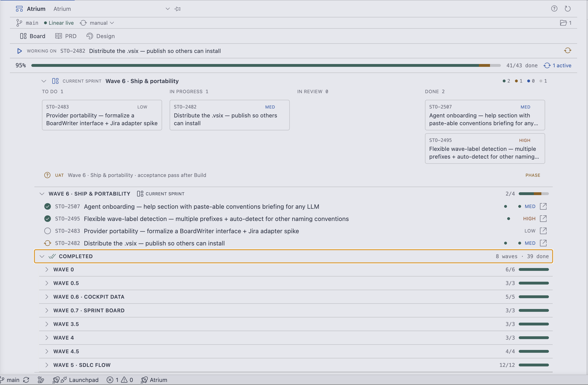
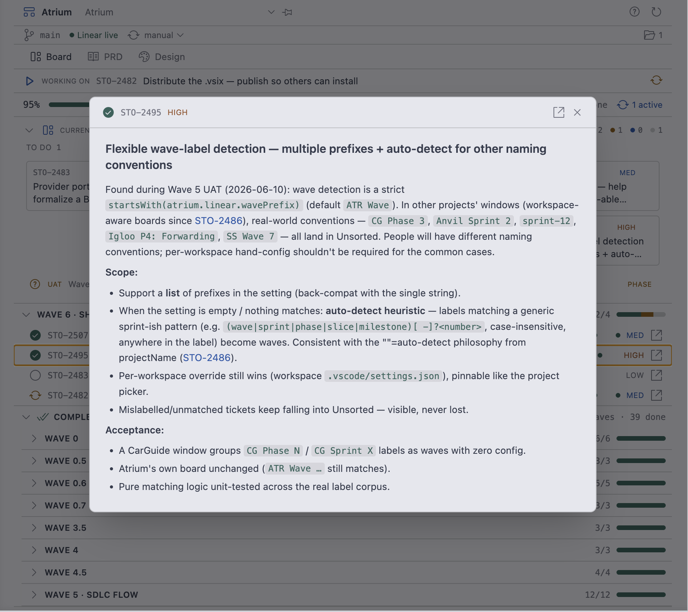
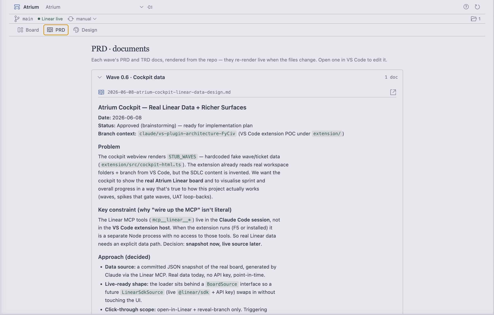
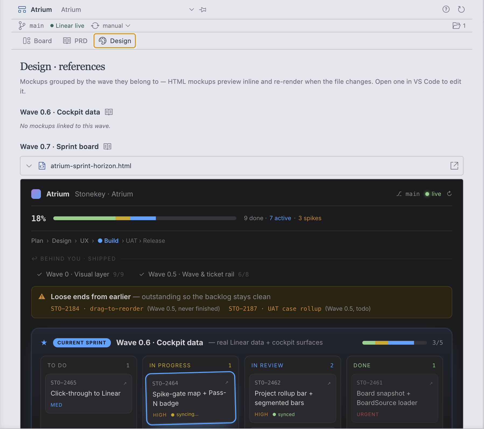

# Atrium Cockpit

**A visual SDLC cockpit for your issue tracker, inside VS Code.**

Atrium turns your sprint board into a first-class VS Code surface: a live kanban
with drag-to-status write-back, your PRDs rendered next to the work, HTML
mockups previewing live as you (or your AI agent) edit them, and a one-click
view of exactly what's being worked on right now. It's a **lens over your
tracker** — it never tries to replace it.

> Built by dogfooding: Atrium's own development was planned, tracked and
> shipped through Atrium.



## What you get

- **The Board** — your project grouped into sprints/waves (detected
  automatically from your labels), with the active sprint spotlighted as a
  kanban. Drag cards between columns to update ticket state, drag to reorder,
  drag between waves to promote/demote — all written back live.
- **Working on** — the ticket matching your current git branch, one click from
  its full description.
- **Ticket modal** — click any ticket for its full description rendered as
  proper markdown, with a link out to edit in your tracker.
- **PRD view** — each wave's PRD and TRD docs (plain markdown files in your
  repo) rendered inline, re-rendering live as the files change.
- **Design view** — HTML mockups grouped by the wave that owns them,
  previewing live in sandboxed iframes. Edit the file, watch it re-render.
- **Freshness without ceremony** — the board re-pulls when your window regains
  focus, plus an optional rolling auto-refresh picker right in the status strip.
- **Agent-ready** — a Help (`?`) button copies a paste-able briefing that tells
  any AI assistant how to label tickets, name branches, and place planning
  files so everything shows up here automatically.





## Install

**Build it yourself** (works today, always current with `main`). You'll need
[Bun](https://bun.sh) installed:

```bash
cd extension
bun install
bun run build
bunx @vscode/vsce package          # produces atrium-cockpit-<version>.vsix
code --install-extension atrium-cockpit-*.vsix
```

Once a tagged release is published, you'll also be able to grab a prebuilt
`.vsix` from the [latest release](../../releases/latest) and skip the build —
download it, then `code --install-extension atrium-cockpit-<version>.vsix` (or in
VS Code: Extensions panel → `···` menu → **Install from VSIX…**).

Then reload the window. The cockpit opens as an editor tab — or click the Atrium
icon in the Activity Bar, the `$(rocket) Atrium` status-bar button, or press
`⌘⌥A` / `Ctrl+Alt+A`.

With no configuration you'll see a bundled **demo board** (a fictional project)
so you can feel the surface immediately.

## Connect your own board (Linear)

1. Create a personal API key at [linear.app/settings/api](https://linear.app/settings/api).
2. VS Code Settings → search **atrium** → paste it into **Atrium › Linear: Api Key**.
3. Reload. Atrium auto-detects which Linear project matches your open folder
   (override any time with the project dropdown in the cockpit header).

Sprints/waves are detected from your labels automatically: any label starting
with your configured prefix(es), or — with zero config — anything sprint-ish
like `Sprint 3`, `Wave 0.7`, `Phase 2 · Core`, `sprint-12`. Unmatched tickets
land in a visible "Unsorted" bucket, never lost.

Full setup detail (including per-workspace pinning and the wave-file
conventions): [`extension/SETUP.md`](extension/SETUP.md).

## Make your repo cockpit-aware

Planning artifacts are plain files in your repo:

| Artifact | Where Atrium looks |
|---|---|
| Wave PRD | `docs/waves/wave-<n>.md` |
| Further docs (TRDs…) | `docs/waves/wave-<n>-<topic>.md` |
| Mockups | `wave-<n>-<name>.html` / `.png` in `files/`, `docs/`, `mockups/`, `design/` |
| Anything oddly named | map it in `.atrium/waves.json` |

Working with an AI assistant? Open the cockpit's **? Help** → **Copy agent
briefing** and paste it into your assistant at project start — it teaches the
conventions above plus ticket labelling and branch naming, with no tool-specific
jargon.

## Configuration

| Setting | Default | What it does |
| --- | --- | --- |
| `atrium.linear.apiKey` | — | Personal API key; enables the live board |
| `atrium.linear.projectName` | `""` (auto) | Pin a Linear project for this workspace |
| `atrium.linear.wavePrefix` | `ATR Wave` | Sprint-label prefix(es), comma-separated; auto-detect kicks in when nothing matches |
| `atrium.linear.pollSeconds` | `0` | Rolling auto-refresh (also adjustable from the status strip) |
| `atrium.openOnStartup` | `true` | Open the cockpit tab when VS Code starts |

## Development

The extension lives in [`extension/`](extension/) (React webview + TypeScript
host, built with Bun + Vite + esbuild):

```bash
cd extension
bun install
bun run typecheck && bun test   # 197 tests
bun run build
bunx @vscode/vsce package       # produces the .vsix
```

## Adapting to another tracker (not Linear)

Atrium talks to Linear today, but it was built to be ported. Reads go through a
single `BoardSource` seam (`extension/src/linear-source.ts`) and writes through a
thin client (`extension/src/linear-writes.ts`) — an adapter for Jira, GitHub
Issues, Asana, etc. only has to reimplement those two surfaces. Everything
upstream (the board model, wave detection, the React cockpit) stays the same.

This is a great job to hand to an AI coding agent after you clone the repo. Paste
the briefing below into your assistant (Claude Code, Cursor, etc.) to scope and
build the adapter:

> **You are adapting the Atrium Cockpit VS Code extension to read/write a
> different issue tracker instead of Linear.** Work only inside `extension/`.
>
> 1. Read `extension/src/linear-source.ts` (the read seam) and
>    `extension/src/linear-writes.ts` (the write seam) to learn the exact shapes
>    Atrium expects — the `BoardSource` interface, the ticket/wave/state types in
>    `extension/src/board.ts` and `extension/webview/types.ts`, and how the demo
>    snapshot `extension/src/atrium-board.json` is structured.
> 2. Create a sibling adapter (e.g. `extension/src/jira-source.ts` +
>    `extension/src/jira-writes.ts`) implementing the **same** interfaces against
>    the new tracker's API. Map the new tracker's concepts onto Atrium's:
>    issues → tickets, a label/sprint/field → waves, workflow states → board
>    columns. Keep the snapshot fallback so the demo board still works with no
>    API key.
> 3. Wire the new adapter in wherever `linear-source` is currently selected, and
>    move the API-key / project settings in `extension/package.json`'s
>    `contributes.configuration` to the new tracker (keep the names generic, e.g.
>    `atrium.tracker.apiKey`).
> 4. Mirror the existing test files (`*.test.ts`) for your adapter and keep
>    `bun run typecheck && bun test` green. Update `extension/SETUP.md` and the
>    "Connect your own board" section of the root `README.md` to describe the new
>    tracker.
>
> Do not change the cockpit UI or the board model — the whole point of the seam
> is that only the source/writes layer is tracker-specific.

## License

[MIT](LICENSE)
